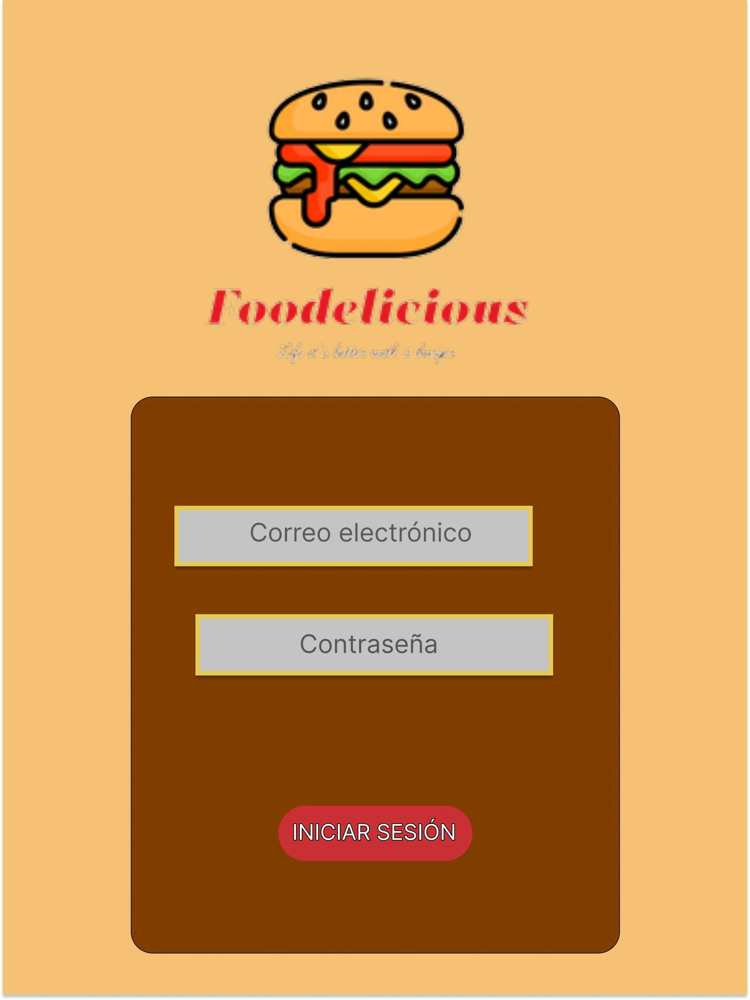
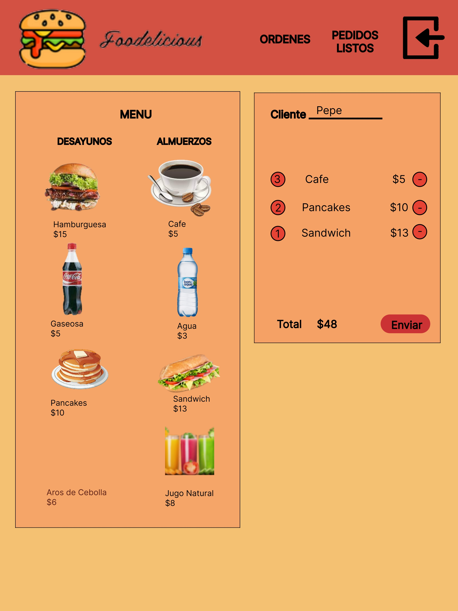
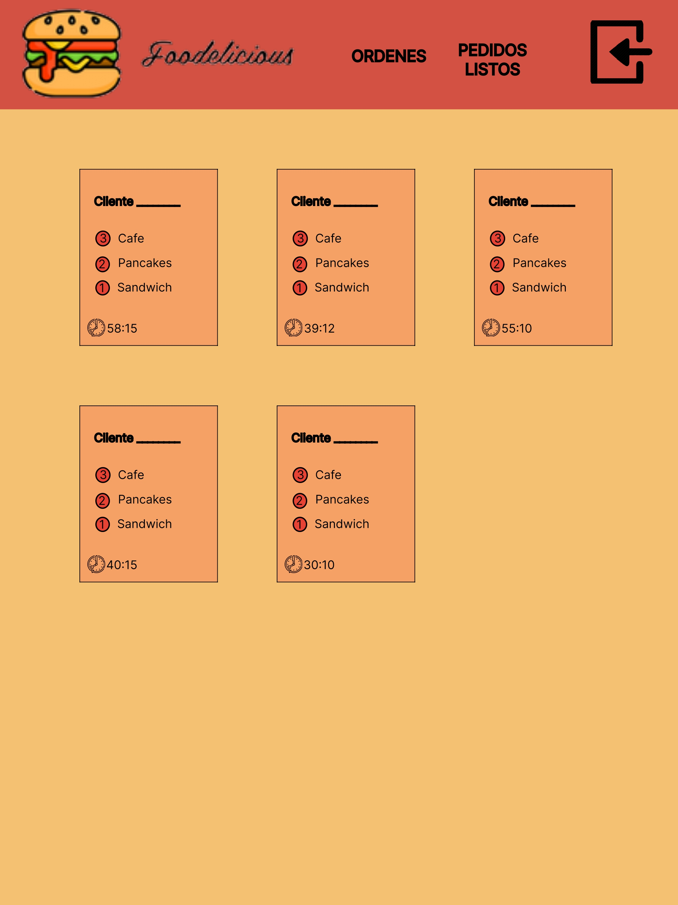
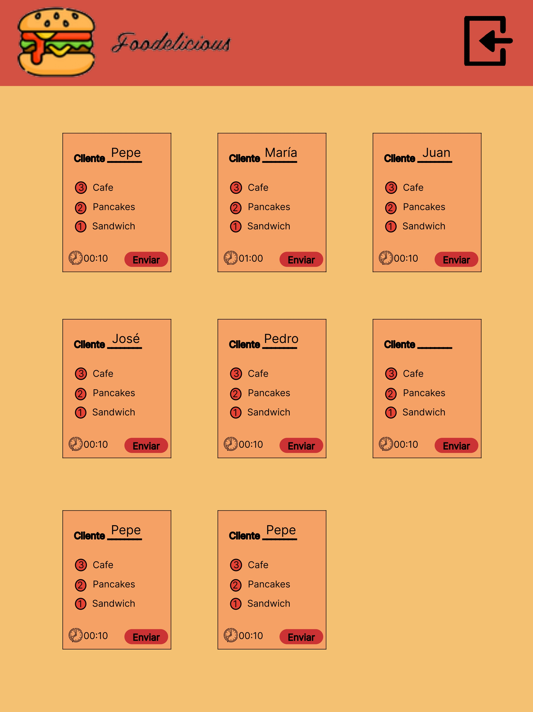
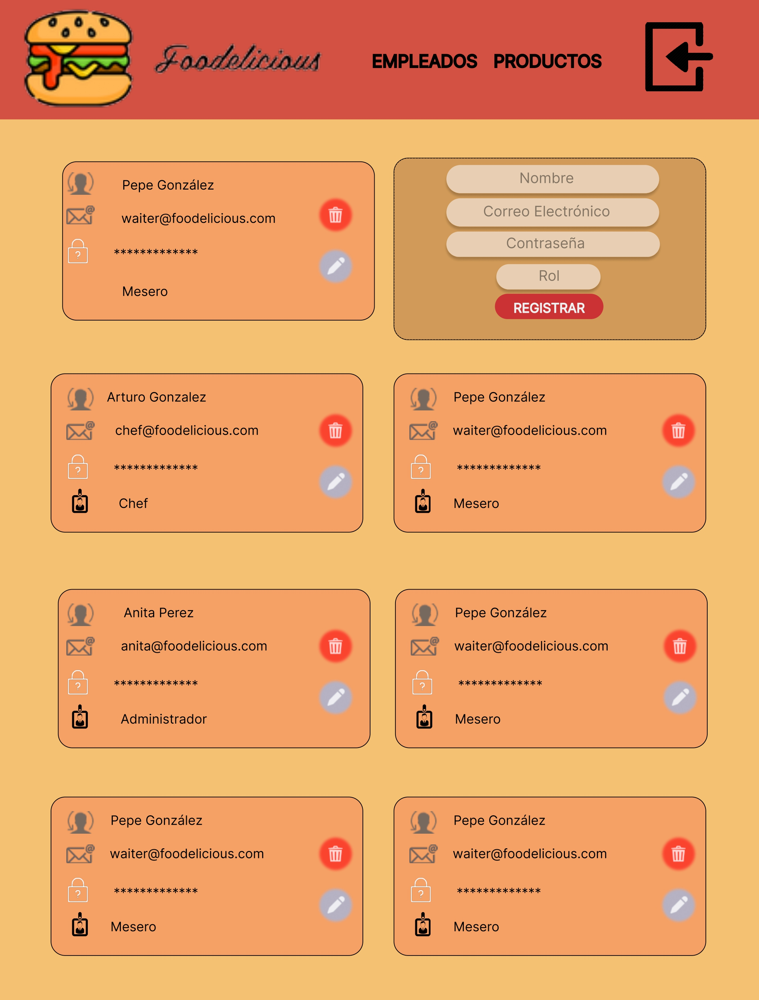
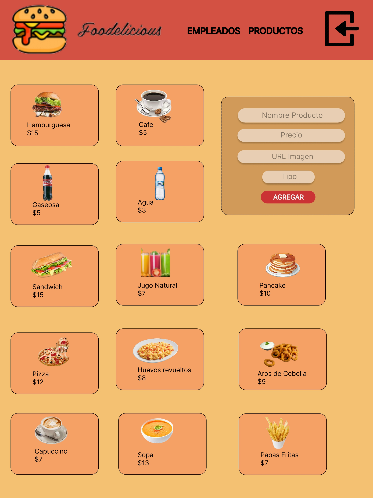

# Burguer Queen - Foodelicious

## Proyecto

Sistema de gestión de pedidos de Restaurante. La aplicación es Single Page App.

## Tecnologías utilizadas

#### Scrum

#### Git

#### React

#### API REST

## Historias de Usuario

* HU1. Yo como meser@ quiero poder ingresar al sistema de pedidos.

* HU2. Yo como meser@ quiero tomar el pedido del cliente para no depender de mi mala memoria, para saber cuánto cobrar, y enviarlo a la cocina para evitar errores y que se puedan ir preparando en orden.

* HU3. Yo como jefe de cocina quiero ver los pedidos de los clientes en orden y marcar cuáles están listos para saber qué se debe cocinar y avisar a los meserxs que un pedido está listo para servirlo a un cliente.

* HU4. Yo como meser@ quiero ver los pedidos que están preparados para entregarlos rápidamente a l@s clientes que las hicieron.

* HU5. Yo como administrador(a) de tienda quiero gestionar a los usuarios de la plataforma para mantener actualizado la informacion de mis trabajadores.

* HU6. Yo como administrador(a) de tienda quiero gestionar los productos para mantener actualizado el menú.

## Prototipos

**Login**

**Mesero**

**Chef**

**Administrador**

## Usuarios para Ingreso

### Administrador

**Email:** anita.borg@systers.xyz
**password:** 123456

### Mesero

**Email:** waiter@foodelicious.com
**password:** 123456

### Chef

**Email:** chef@foodelicious.com
**password:** 123456
